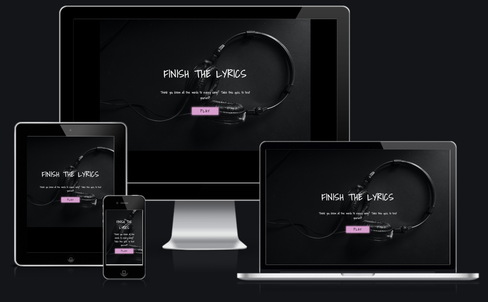

<h1 align="center">FINISH THE LYRICS</h1>

This is a fun musical lyric quiz where the user can test their knowledge on song lyrics.  The user is presented with a line of lyrics from different songs with some lyrics missing and the user must select the correct lyrics to complete the line.  

The live site can be found [here](https://bzemba87.github.io/finish-the-lyrics/)

<h2 align ="center"></h2>

## User Experience 

### User Stories

### First Time User Goals
1.  As a first time user, I want to know the aim of the game immediately 
2. As a first time user, I want to be able to control when I can start the quiz and/or see the questions by being able to select play when I am ready 
3. As a first time user, I want to know if my selected answer for each question is correct before moving on to the next one 
4. As a first time user, I want to know my total score at the end of the quiz 
5. As a first time user, I want the option to play the quiz again

### Returning User Goals
1. As a returning user, I want to improve my score 

## Design

### Wireframes

The design of my quiz has changed a bit since I made these Wireframes.  

- [Quiz Intro](https://github.com/BZemba87/finish-the-lyrics/blob/main/Wireframe-Quiz-Intro%20.jpg)
- [Quiz Page](https://github.com/BZemba87/finish-the-lyrics/blob/main/Wireframe-Quiz-Page.jpg)

### Colour Scheme:
- I wanted a dark aesthetic with pops of bright, fun colour for Finish the Lyrics.  I chose black for the background and pink, light blue and pale turquoise for the buttons.  I decided on white for the font colour as it stands out against the black.  

Colours used:
Black - #000000
White - #5F5F5
Pink - #E29CD2
Turquoise - #AFEEEE
Blue - #87CEFA

### Typography:
- I used one font throughout the entire site.  I chose Shadows Into Light as it matches the theme of the quiz because I feel it looks like handwritten song lyrics but is also clear and easy to read.  

### Imagery:
- The background image on the intro page (index.html) is well suited to the music theme and colour scheme of the site.  

## Features

### Intro Page
This is the page that appears when the site is loaded.  It contains the name of the quiz and a simple strapline that immediately gives the user information as to what the quiz is about and what the aim is.  The name of the quiz is also self explanatory.  The play button redirects the user to the game.html page to start the quiz when pressed.  

