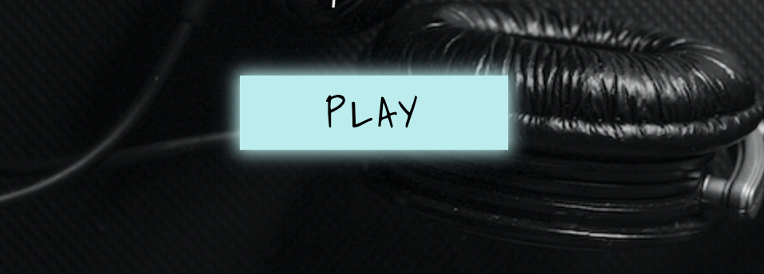
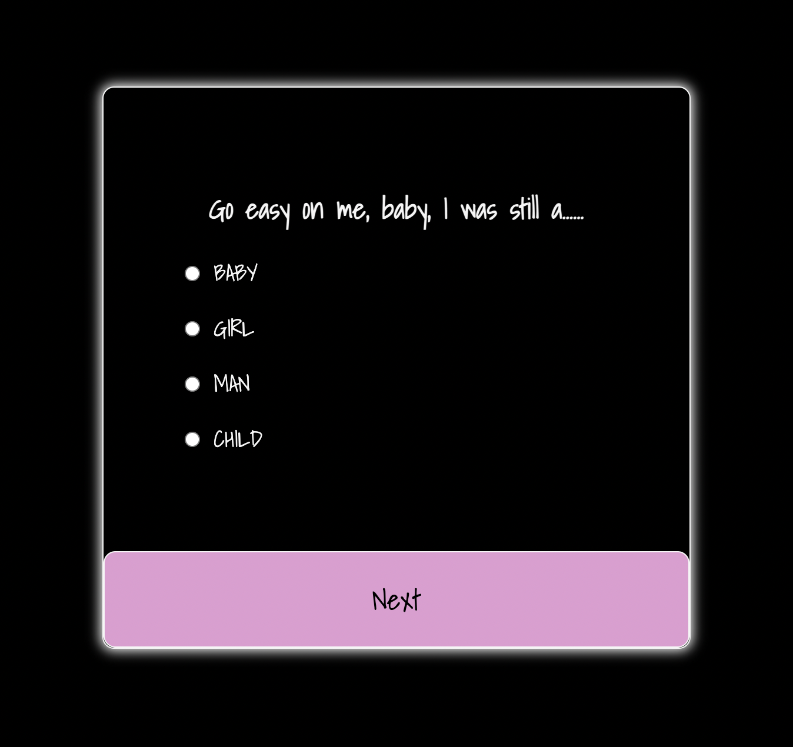
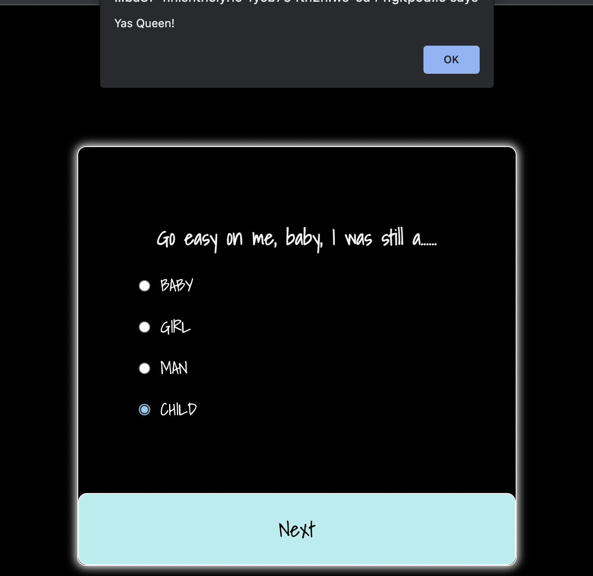
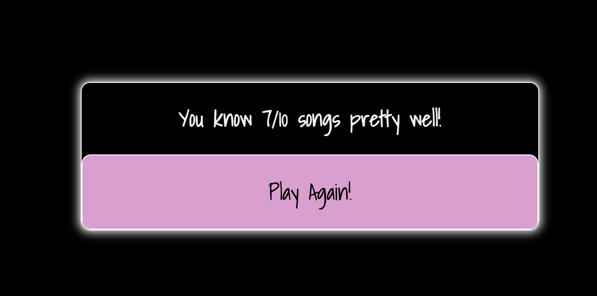
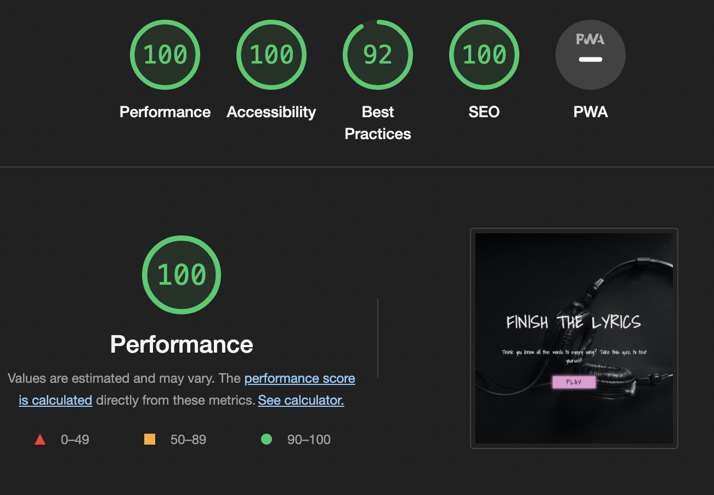
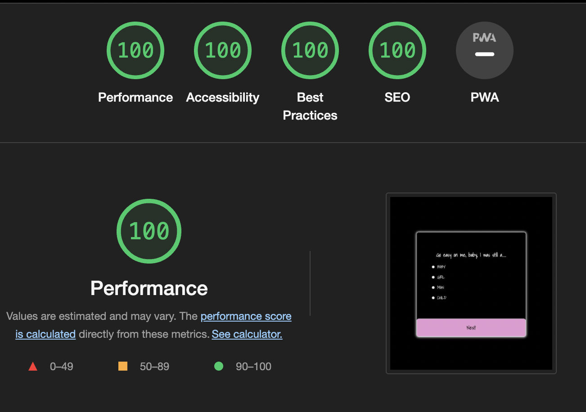
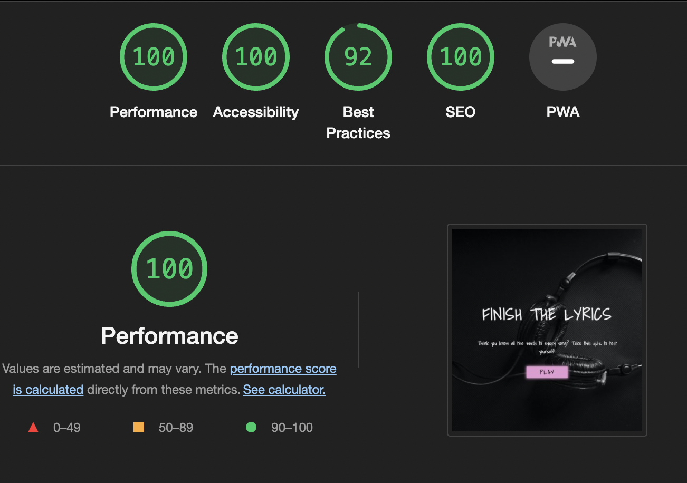
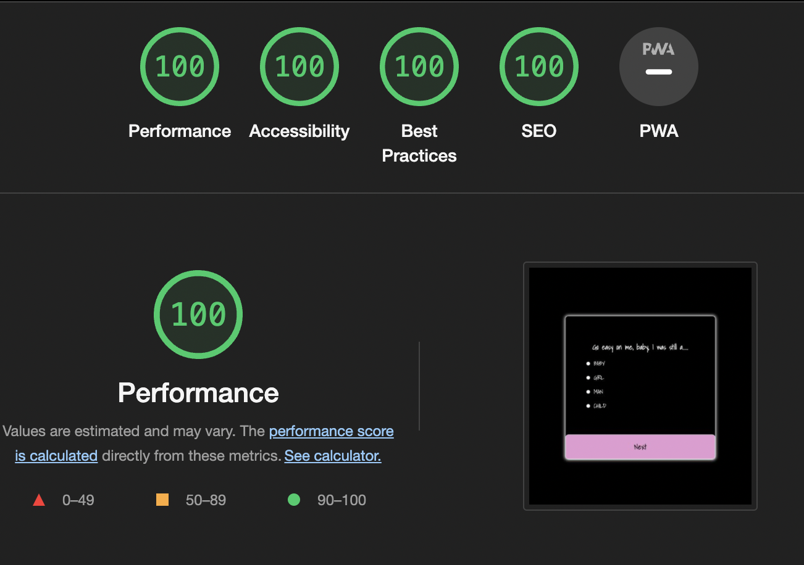

<h1 align="center">FINISH THE LYRICS</h1>

This is an interactive, fun, musical lyric quiz where the user can test their knowledge on song lyrics.  The user is presented with a line of lyrics from different songs with some lyrics missing and the user must select the correct lyrics to complete the line.  

The live site can be found [here](https://bzemba87.github.io/finish-the-lyrics/)

<h2 align ="center"></h2>

# User Experience 

## User Stories

### First Time User Goals
1.  As a first time user, I want to know the aim of the game immediately 
2. As a first time user, I want to be able to control when I can start the quiz and/or see the questions by being able to select play when I am ready 
3. As a first time user, I want to know if my selected answer for each question is correct before moving on to the next one 
4. As a first time user, I want to know my total score at the end of the quiz 
5. As a first time user, I want the option to play the quiz again

### Returning User Goals
1. As a returning user, I want to improve my score 

# Design

### Wireframes

The design of my quiz has changed a bit since I made these Wireframes.  

- [Quiz Intro](https://github.com/BZemba87/finish-the-lyrics/blob/main/Wireframe-Quiz-Intro%20.jpg)
- [Quiz Page](https://github.com/BZemba87/finish-the-lyrics/blob/main/Wireframe-Quiz-Page.jpg)

### Colour Scheme:
- I wanted a dark aesthetic with pops of bright, fun colour for Finish the Lyrics.  I chose black for the background and pink, light blue and pale turquoise for the buttons.  I decided on white for the font colour as it stands out against the black.  

Colours used:
Black - #000000
White - #5F5F5
Pink - #E29CD2
Turquoise - #AFEEEE
Blue - #87CEFA

### Typography:
- I used one font throughout the entire site.  I chose Shadows Into Light as it matches the theme of the quiz because I feel it looks like handwritten song lyrics but is also clear and easy to read.  

### Imagery:
- The background image on the intro page (index.html) is well suited to the music theme and colour scheme of the site.  

# Features

### Intro Page
- This is the page that appears when the site is loaded.  It contains the name of the quiz and a simple strapline that immediately gives the user information as to what the quiz is about and what the aim is.  The name of the quiz is also self explanatory.  The play button redirects the user to the game.html page to start the quiz when pressed.  

- The play button has a hover and focus effect - it turns pale turquoise when the user rolls over it and light skyblue when the user clicks it.  

### Game Page 
- This is the page that the user is redirected to when they click the play button.  The user is shown the first of 10 lines of lyrics and must select the correct answer out of the 4 options shown.  
- Once selected, the radio button turns blue and pressing next will generate a pop up alert to notify the user they have answered correctly (Yas Queen!) or incorrectly ('Oh No!') before displaying the next line of lyrics and answer options.  
- The next button also has a hover and focus effect.  

### End of the Quiz
- Results are displayed and a play again button appears to allow users to start from the beginning without having to refresh the page.  

## Extra Features to be Added
- Leaderboard
- Username Input 

### Languages and Programs Used
- HTML
- CSS
- Javascript
- Balsamiq (wireframes)
- Pexels (background image)
- Google Fonts (used to import Shadows Into Light)
- Git (used for version control, commiting and pushing to Github)
- Github (used to store the repositories, files and images after being pushed from Git)
- Am I Responsive (used to test and display responsiveness of the site on different screen sizes)
- Chrome Developer Tools (used to check accessibility, compatibility, troubleshooting and editing code)

# Testing

## Testing User Stories  from User Experience

### First Time User Goals
1.  I want to know the aim of the game immediately 
- When the user loads the landing page, they are greeted with the name of the quiz which is very self explanatory and the strapline which asks them if they think they know the words to every song and then invites them to test themselves.  

2. I want to be able to control when I can start the quiz and/or see the questions by being able to select play when I am ready 
- Users can control when to start playing as the quiz cannot begin and the questions/lyrics are not displayed until the play button is pressed.  

3. I want to know if my selected answer for each question is correct before moving on to the next one 
- When the next button is clicked, a pop up alert is generated to notify the user if they answered the last question correctly or incorrectly before moving on.

4. I want to know my total score at the end of the quiz 
- When all 10 questions have been answered, the user's results will be displayed at the end.

5.  I want the option to play the quiz again
- Underneath the user's results, the play again button is displayed giving the user the option to restart the quiz.  

# More Testing

I ran the code through JShint, W3C Markup Validator, W3C Jigsaw Validator for the intro page and game page of my site.

- [W3C Jigsaw Validator - style.css](https://jigsaw.w3.org/css-validator/validator)
- [W3C Jigsaw Validator - game.css](https://jigsaw.w3.org/css-validator/validator)
- [W3C Validator - index.html](https://validator.w3.org/nu/#textarea)
- [W3C Validator - game.html](https://validator.w3.org/nu/#textarea)
- JShint - I had a lot of missing semi-colons which were corrected and one warning which states:  Incompatible values for the 'esversion' and 'es3' linting options. (7% scanned).

## Errors:

- I was given 1 error on the game.html page - there was a stray closing div tag on line 55.  I removed this and now there are no errors or warnings.  
- I received 1 warning on the style.css - I had not put '' around the font-family on line 9.  I have done this now and there are no errors or warnings.  

## Devices:

- The quiz has been tested on MacBook Air, Samsung SE10, iPhone 12, iPhone XS Max
- The quiz has been tested and works on Google Chrome, Safari and Mozilla Firefox

## Lighthouse:

- Both pages have been tested on Lighthouse for desktop and mobile:

## Intro Page - Desktop 

## Game Page - Desktop

## Intro Page - Mobile

## Game Page - Mobile

## Functionality:
- The play, next and play again buttons have been clicked multiple times to ensure they work
- The accent color on the selected radio buttons works
- The correct/incorrect answer alert window pop-up has worked multiple times 
- Each page loads correctly

## Solved Errors:
- I could not target the questions/answers array so I changed the structure of the quiz section.  

## Bugs:
- The alert window for correct/incorrect answers does not pop up on an iPhone12 and I am not sure why as it works on every other device I have tested it on.

# Deployment
### GitHub Pages
The site was deployed to GitHub Pages with the following steps:

- Log in to GitHub and locate the GitHub Repository
- At the top of the Repository (not top of page), locate the "Settings" Button on the menu.
- Scroll down to "Github Pages" where it says "Pages settings now has its own dedicated tab!" - click on the link.
- Under "Source", click the dropdown called "None" and select "Main Branch".
- The page will automatically refresh and the now published site link in "GitHub Pages" will appear.

### How to Fork a Repository:
- Log in to GitHub and go to the repository (https://github.com/BZemba87/finish-the-lyrics).
- Click the "fork" button in the top right corner (just above "Settings").
- This should generate a forked version of the repository in your own repository.

### How to Make a Clone:
- Login in to GitHub and go to https://github.com/BZemba87/finish-the-lyrics
- Under the repository name, click Code
- Here you will have two options, Clone or Download the repository
- Clone the repository using HTTPS by clicking on the icon to copy the link
- You can either launch the Gitpod workspace or choose your own directory
- Open Git Bash
- Type git clone and then paste the URL you copied in step 4
- Press Enter, to create your local clone to your chosen directory

# Credits

## Youtube Tutorials:
- ### Zenva - "Creating a Basic Quiz" 
- I watched this tutorial to help me understand the basics of creating a quiz.  
- ### Web Dev Simplified - "Build a Quiz App with Javascript"
- I watched this tutorial multiple times.
- ### Coding with Nick - "Create a Quiz App using HTML CSS & JavaScript"
- I watched this tutorial and used it to help build my own quiz - I have used a lot of the code from here.
- ### Brian Designs - "How to Make a Quiz App using HTML CSS Javascript"
- I watched this tutorial for guidance on creating the intro page and play button.

# Tips and Guidance:
- ### Love Maths
- I went through the Love Maths project again and used it as guidance for certain parts.
- CI course material 
- stackoverflow.com
- CI Slack channel comments and searches 

